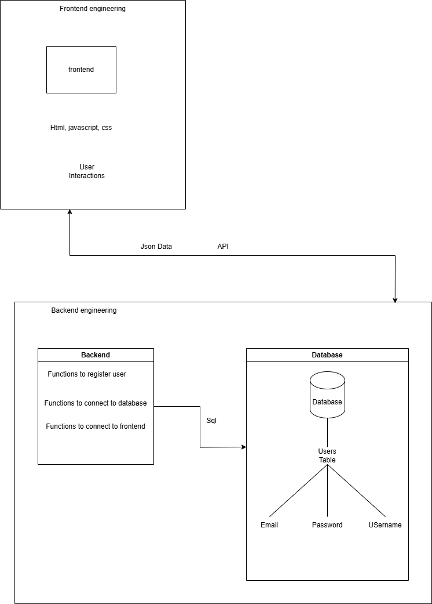

---

<h3><a href='./1.0. Course_Outline.md'>Previous Chapter << Course Outline Page <<</a></h3>
<h3><a href='./1.2. Version_Control.md'>Next Chapter >> Version Control >></a></h3>

---

# Full Stack Software Developer
A **full stack software developer** is a professional who is proficient in both front-end (client-side) and back-end (server-side) development, allowing them to build a complete and functional application. Below is a detailed breakdown:

## Full Stack Software Engineering

## Modules
- Frontend Module
- Backend Module
- Database Module

### 1. Frontend Module
- The frontend module is responsible for interacting with the user, communicating with the system, and retrieving the responses to the user.
- User information (including requests e.g. login details) are translated in form of JSON data. However, the frontend uses html and css to style elements for user to interact with.

### 2. Backend Module
- The backend module is responsible for translating user requests and responses between the database and the frontend.
- For example, if a user wants to login, they enter their details in the input form in the frontend, which is transfered into the backend module through an api. The api used, links it with the speific function that will save or retrieve the details from the database tables.
- An api is like a link, which points onto a specific function that will be performing a function.
- The following are the available methods in an api:
- Api calls can be made using different HTTP methods depending on the operation you want to perform, which are:
   1. Get - Retrieve Data
      - Used to fetch data from an API
      - Example fetch a list of users

   2. Post - Create Data
      - Used to send data to the API to create a new resource/item
      - Example register a new user

   3. Put - Update Data
      - Used to update an existing resource completely
      - Example update user details

   4. Patch - Partially Update Data
      - Used to update part of a resource instead of replacing it entirely
      - Example update only the email of a user

   5. Delete - Remove Data
      - Used to delete a resource/item
      - Example delete a user

- An example of a tool used to run api calls is the `Postman`.

### 3. Database Module
- The database module is responsible for saving data used in an application.
- The database communicates with the backend using sql queries, meaning the data is saved in sql formats.
- This means that the backend is used to translate the JSON data received from the frontend into sql for the database and inverse when retrieving data from the database to the frontend.
- However, a database is optional, since there are other applications which does not require database and saves their data in a different way.
- Another thing to note is that there are sql databases and no-sql database. Below is the difference between them:

|Feature	|SQL Databases	|NoSQL Databases|
|--------|--------------|---------------|
|Data Structure	|Structured (Tables with rows & columns)	|Unstructured or Semi-structured (Documents, Key-Value, Graph, Column-family)|
|Schema	|Fixed schema (Predefined structure)	|Dynamic schema (Flexible structure)|
|Scalability	|Vertically scalable (Adding more power to a single server)	|Horizontally scalable (Adding more servers/nodes)|
|Data Integrity	|Follows ACID properties (Atomicity, Consistency, Isolation, Durability)	|Follows CAP theorem (Consistency, Availability, Partition Tolerance - but not all at once)|
|Query Language	|Uses SQL (Structured Query Language)	|Uses various querying techniques (JSON-like, key-value lookups, graph traversal, etc.)|
|Best For	|Complex queries, structured data, and transactions	|Large-scale applications, unstructured data, and fast reads/writes|
|Examples	|MySQL, PostgreSQL, MS SQL Server, Oracle	|MongoDB, Firebase Firestore, Cassandra, Redis|

### When to Use SQL vs NoSQL?
- Use SQL when you need:
   - Strong consistency (e.g., financial applications, banking)
   - Complex queries (e.g., reporting, analytics)
   - Well-defined relationships (e.g., customer orders, employee records)
- Use NoSQL when you need:
   - Scalability (e.g., social media, real-time analytics)
   - High-speed data ingestion (e.g., IoT applications)
   - Flexible schema (e.g., dynamic user profiles, catalogs)

---

### Front-End Development
This focuses on the user-facing side of applications, dealing with what users see and interact with.

#### Core Skills:
1. **HTML/CSS**:
   - **HTML (HyperText Markup Language)**: Structures the content on the web.
   - **CSS (Cascading Style Sheets)**: Styles the layout, appearance, and responsiveness of web pages.
   - Tools: Bootstrap, TailwindCSS for responsive design.

2. **JavaScript**:
   - Adds interactivity to web pages.
   - Frameworks/Libraries: React, Angular, Vue.js for building complex UIs.

3. **User Interface/ User Xperience Design Basics**:
   - Understanding of user interface (UI) design and user experience (UX) principles.
   - Tools: Figma, Adobe XD.

---

### Back-End Development
This involves the server-side logic and database management that powers the front-end.

#### Core Skills:
1. **Programming Languages**:
   - Common choices: Python, Java, JavaScript (Node.js), Ruby, PHP, or C#.

2. **Frameworks**:
   - Help streamline server-side development.
   - Examples: Express.js (Node.js), Django (Python), Spring Boot (Java), ASP.NET (C#).

3. **Database Management**:
   - Understanding relational databases (MySQL, PostgreSQL) and NoSQL databases (MongoDB, Firebase).

4. **APIs**:
   - Creating and consuming RESTful APIs or GraphQL for communication between client and server.

5. **Authentication and Authorization**:
   - Managing user logins and data protection.
   - Tools: OAuth, JWT (JSON Web Tokens).

---

### Version Control
1. **Version Control**:
   - Proficiency in Git and GitHub for managing front-end code.
   - Other available version controls include azure devops, etc.

---

### DevOps and Deployment
Full stack developers often manage application deployment and maintenance.
- These includes pipelines to manage many operations.

#### Core Skills:
1. **Cloud Platforms**:
   - Examples: AWS, Azure, Google Cloud for hosting and scaling applications.

2. **Containerization**:
   - Tools: Docker, Kubernetes for deploying and managing applications in containers.

3. **CI/CD**:
   - Continuous Integration and Continuous Deployment pipelines using tools like Jenkins, GitHub Actions.

4. **Monitoring**:
   - Using tools like Prometheus or New Relic to monitor application performance.

---

### Terminal commands
Be knowledged on some commands used in the commonly used terminals e.g. `bash`, `powershell`, e.t.c.

---

### Soft Skills
1. **Problem-Solving**:
   - Ability to debug and resolve issues across the stack.

2. **Collaboration**:
   - Working with designers, other developers, and stakeholders.

3. **Adaptability**:
   - Quickly learning new technologies or tools as needed.

---

### Tools and Technologies
1. **IDE/Editors**: VSCode, IntelliJ IDEA.
2. **Task Runners**: Webpack, Gulp.
3. **Testing**: Jest, Mocha, Selenium.
4. **Version Control**: Git/GitHub.
5. **Documentation**: Markdown, Swagger (for APIs).
